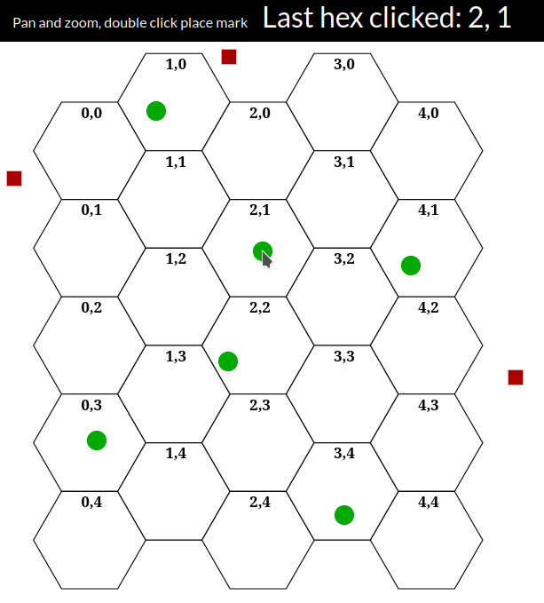

# REACT-BWAR 

A rewrite of my old BWAR project that converts it into a React application.

# Documentation
* https://svgjs.dev/docs/3.0/
* https://www.redblobgames.com/grids/hexagons/

# Livedemo

* https://vocal-puppy-27b12a.netlify.app/

# Screenshot

# Update History

## [4] Drawing and selecting hexes
* Create coordinate system class
* Convert between pixel to hex to pixel 
* Draw a hex grid
* Double click a hex to select
* Show coordinate of clicked hex
* Use green circle to mark valid hex click
* Use red circle to mark off map click

## [3] BWAR basic layout
* Created BWARController and BWARView
* Can attach BWARView to target div and load SVG

## [2] SVG panning and zooming
* Import the SVG.PANZOOM.JS plugin
* Create an SVG document with a large square
* Double click to add a circle at click point
* Pan and zoom works with mouse or touch 

## [1] Project creation and initial setup
* Create a simple "header content footer" layout
* Use sass styling
* Import the SVG.JS library
* Show basic SVG.JS usage with React
    * Add an SVG document that fills the content area
    * Add rectangle elements to the document

# License

This program is free software: you can redistribute it and/or modify it under the terms of the GNU General Public License as published by the Free Software Foundation, either version 3 of the License, or (at your option) any later version.

This program is distributed in the hope that it will be useful, but WITHOUT ANY WARRANTY; without even the implied warranty of MERCHANTABILITY or FITNESS FOR A PARTICULAR PURPOSE. See the GNU General Public License for more details.

You should have received a copy of the GNU General Public License along with this program. If not, see https://www.gnu.org/licenses/.