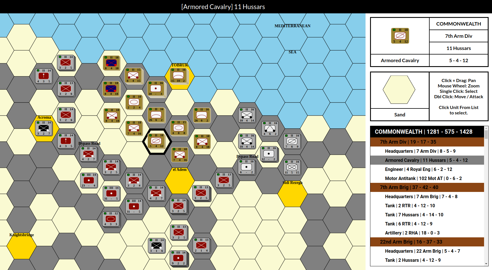
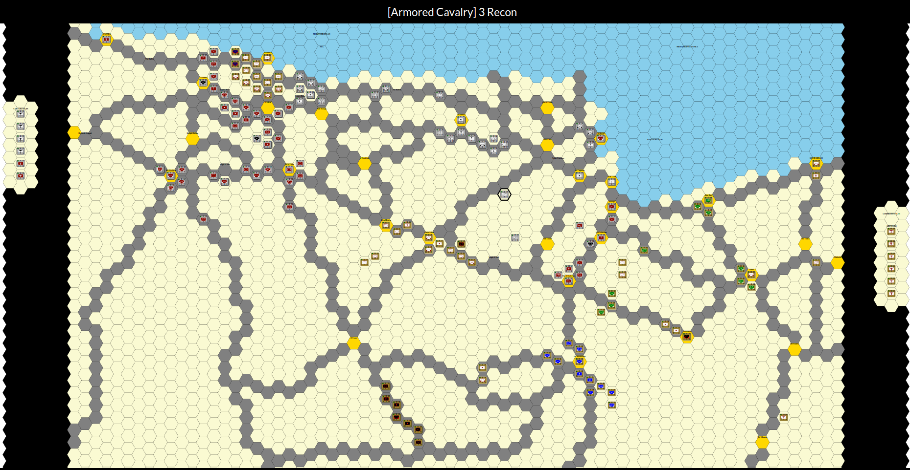

# REACT-BWAR 

A rewrite of my old BWAR project that converts it into a React application.

# Documentation
* https://svgjs.dev/docs/3.1/
* https://www.redblobgames.com/grids/hexagons/

# Livedemo

* https://vocal-puppy-27b12a.netlify.app/

# Screenshots

# Update History

## [12] Added sidebar with order of battle
* Order of battle with forces, formations, and units
* Click a unit on OOB to select and zoom to it
* Click a unit on map to select it in OOB
* Unit and Hex information areas update when selected items change
* Sidebar disabled on smaller displays

## [11] Crusader41 Scenario
* Display the Crusader41 "Siege of Tobruk" scenario from original BWAR
* Units stack in hex, clicking hex cycles stack
* Controller and model now work with scenarios which are stored as json files
* Combat system mechanics are working but values aren't tuned so ignore results
* 3192 hexes, 332 unit counters
* Desktop performance is good except when zoomed all the way out
* Mobile performance a little slower but not bad

## [10] Unit symbols and stats, basic combat
* Unit symbols drawn on counter
* Unit numeric stats shown and can be changed
* Status indicator shows health of unit Green -> Orange -> Red
* Click unit to select, double click empty hex to move
* Double click an adjacent hex with an enemy to attack
* No unit stacking this version
* Demo: https://jolly-smakager-1f6886.netlify.app/

## [9] Performance Testing
* Created larger map with 25 red 25 blue units
* Created a number of City (Gold) hexes
* Roads are drawn between the cities
* Click button and all units pathfind to a random hex
* Issue with SVG.JS .font().move() performance, hex coordinates causing slowdown, to be resolved

## [8] Sides, stacks, and moving multiple units
* Created order of battle and utility functions
* OOB tracks sides, forces, formations, and units
* Unit counters have colors, red vs blue
* Click a hex to select it and any units
* Double click a hex to pathfind a selected unit

## [7] Pathfinding and animated moves
* Least expensive path is found using terrain type for cost
* Unit movement is animated along each step
* Road (Gray) is least expensive hex to enter
* Grass (Green) is average cost
* Hill (Brown) is most expensive
* Water (Blue) cannot be entered

## [6] Unit drawing and moving
* Create a unit and add to unit list
* Draw unit counter to view
* Clicking a hex moves unit to that hex

## [5] Created model, map array, terrain types
* Model holds map and unit list
* Terrain types with draw colors and movement costs
* Clicking a hex identifies terrain type

## [4] Drawing and selecting hexes
* Create coordinate system class
* Convert between pixel to hex to pixel 
* Draw a hex grid
* Double click a hex to select
* Show coordinate of clicked hex
* Use green circle to mark valid hex click
* Use red circle to mark off map click

## [3] BWAR basic layout
* Created BWARController and BWARView
* Can attach BWARView to target div and load SVG

## [2] SVG panning and zooming
* Import the SVG.PANZOOM.JS plugin
* Create an SVG document with a large square
* Double click to add a circle at click point
* Pan and zoom works with mouse or touch 

## [1] Project creation and initial setup
* Create a simple "header content footer" layout
* Use sass styling
* Import the SVG.JS library
* Show basic SVG.JS usage with React
    * Add an SVG document that fills the content area
    * Add rectangle elements to the document

# License

This program is free software: you can redistribute it and/or modify it under the terms of the GNU General Public License as published by the Free Software Foundation, either version 3 of the License, or (at your option) any later version.

This program is distributed in the hope that it will be useful, but WITHOUT ANY WARRANTY; without even the implied warranty of MERCHANTABILITY or FITNESS FOR A PARTICULAR PURPOSE. See the GNU General Public License for more details.

You should have received a copy of the GNU General Public License along with this program. If not, see https://www.gnu.org/licenses/.